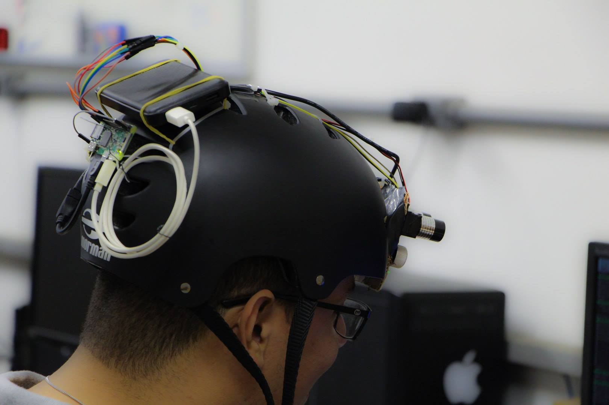

## Welcome to my personal page

My name is Mateus Coelho Silva. Currently, I am a Ph.D. Student at the Federal University of Ouro Preto, Minas Gerais, Brazil. I have a bachelor's degree in Control and Automation Engineering from the Federal University of Minas Gerais, and a Master's Degree in Computer Science from the Federal University of Ouro Preto. I have also lived in Germany, where I learned the language, studied and was an intern at Fraunhofer IOF (Jena). I have worked as a Substitute Professor at the Federal Institute of Education, Science and Technology of Minas Gerais.

You can check out about my scientific contributions at:

- [ResearchGate](https://www.researchgate.net/profile/Mateus-Silva-19)
- [Google Scholar](https://scholar.google.com/citations?user=aCVeTgQAAAAJ&hl=pt-BR)
- [Lattes](http://lattes.cnpq.br/8847164671735636)

Below, a resumeé of my publications list.

### Publications List

- Dias, P. G. F., Silva, M. C., Rocha Filho, G. P., Vargas, P. A., Cota, L. P., & Pessin, G. (2021). Swarm Robotics: A Perspective on the Latest Reviewed Concepts and Applications. Sensors, 21(6), 2062.
- Garrocho, C. T. B., Silva, M. C., Ferreira, C. M. S., da Cunha Cavalcanti, C. F. M., & Oliveira, R. A. R. (2020). Real-Time Systems Implications in the Blockchain-Based Vertical Integration of Industry 4.0. IEEE Annals of the History of Computing, 53(09), 46-55.
- Silva, M. C., de Sousa, F. L. M., Barbosa, D. L. M., & Oliveira, R. A. R. (2020). Constraints and Challenges in Designing Applications for Industry 4.0: A Functional Approach. In ICEIS (1) (pp. 767-774).
- Silva, M., & Oliveira, R. (2019, July). Analyzing the Effect of Increased Distribution on a Wearable Appliance. In 2019 IEEE 43rd Annual Computer Software and Applications Conference (COMPSAC) (Vol. 2, pp. 13-18). IEEE.
- Silva, M. C., Amorim, V. J., Ribeiro, S. P., & Oliveira, R. A. (2019). Field Research Cooperative Wearable Systems: Challenges in Requirements, Design and Validation. Sensors, 19(20), 4417.
- JP Amorim, V., C Silva, M., & AR Oliveira, R. (2019). Software and Hardware Requirements and Trade-Offs in Operating Systems for Wearables: A Tool to Improve Devices’ Performance. Sensors, 19(8), 1904.
- Santos, R. C. C. D. M., Silva, M. C., & Oliveira, R. A. R. (2019, November). Evaluating the Effect of Audio Feedback on the Behavior of Automotive Fatigue and Distraction Detection System Users. In 2019 IX Brazilian Symposium on Computing Systems Engineering (SBESC) (pp. 1-8). IEEE.
- Silva, M. C., Ribeiro, S. P., Delabrida, S., Oliveira, R. A. R., do Cruzeiro, C. U. M., Vasconcelos, R. D., & Preto-MG-Brazil, B. O. (2019, July). Smart-Helmet development for Ecological Field Research Applications. In Proceedings of the XLVI Integrated Software and Hardware Seminar, SBC, Porto Alegre, Brasil (pp. 69-80).
- Silva, M., Delabrida, S., Ribeiro, S., & Oliveira, R. (2018, November). Toward the design of a novel wearable system for field research in ecology. In 2018 VIII Brazilian Symposium on Computing Systems Engineering (SBESC) (pp. 160-165). IEEE.

#### M.Sc. Dissertation
- SILVA, Mateus Coelho. Uso de equipamento vestível para captura do ambiente florestal: estudo de caso: contagem de folhas de dossel. 2019.
